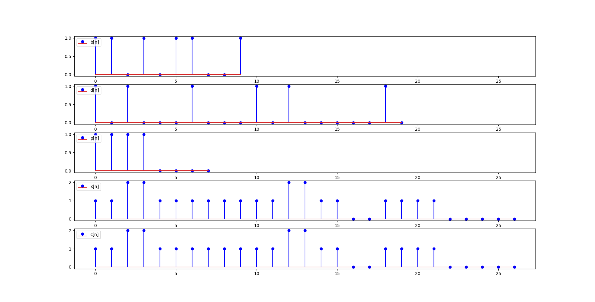

## Ejecución

```
python ej03.py
```

## Descripción


El script de simulación se debe agregar al repositorio, en la carpeta de entrega correspondiente.

Asimismo, en la misma carpeta, se debe agregar un archivo README.md que contenga las capturas de la simulación y una breve explicación de lo que se está mostrando en cada caso. Este archivo debe contener las instrucciones para ejecutar el script.


En la siguiente figura se muestra las señales para cada etapa del diagrama de bloques del ejercicio, teniendo en cuenta:
- M = 2
- FIR de respuesta cuadrada de 8 muestras.
- Canal ideal.

