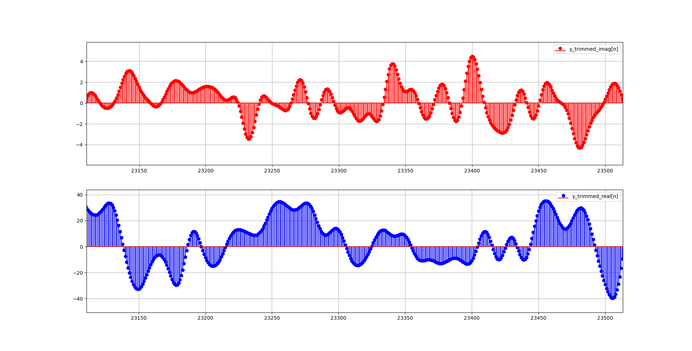
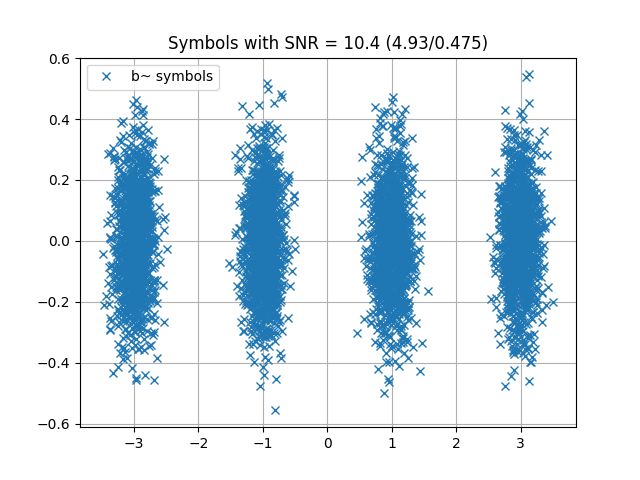
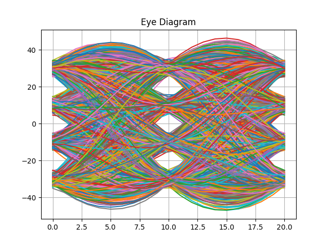
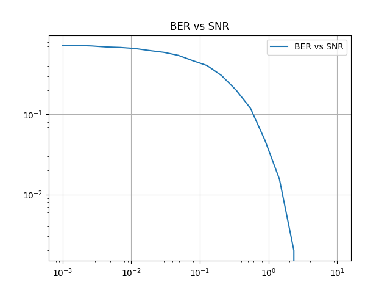
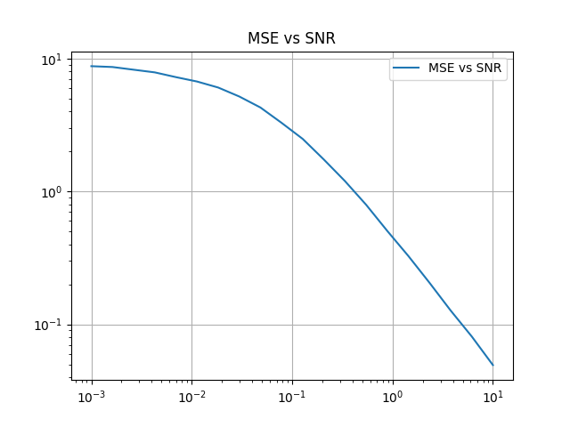

## Trabajo Práctico 5

Simulación del sistema completo para una modulacion PAM4.

### Descripción

Para correr la simulacion se debe ejecutar el archivo `ejercicio.py` de la forma
```
python ejercicio.py
```

El script realiza, en etapas separadas, el grafico de:
1. Todas las señales de interes como tambien de las respuestas al impulso `p` y `h`.
2. El mapa de simbolos detectados a la salida del sistema.
3. El diagrama de ojo del sistema (antes de realizar el down sampling y normalizar la señal).
4. BER y MSE vs SNR.

Las siguientes figuras ilustran el comportamiento que debe esperarse del sistema con las configuraciones por defecto.

1. Parte de la señal `y`.


2. Mapa de simbolos detectados.


3. Diagrama de ojo.


4. BWR y MSE vs SNR.



5. GIF de evolución del sistema para distintas respuestas al impulso de los filtros FIR y el canal.


