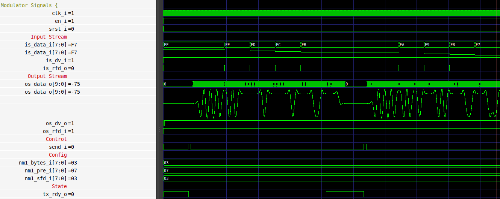
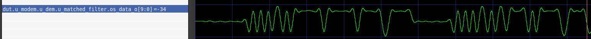
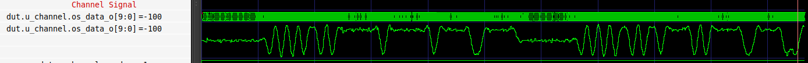

## Trabajo Práctico 8: Simulación del código RTL del modulador y el canal.

Se logró simular con éxito el modem y el canal. Se pudieron observar las siguientes señales.

- `send_i`: Indicando cuando el modulador puede transmitir. Para ello el modulador debe estar listo para transmitir, lo cual se indica en la señal `tx_rdy_o`
- `is_data_i` y `os_data_o`: que corresponden a los datos de entrada y salida respectivamente. Se puede apreciar la modulacion del canal al formatear la señal de salida como analogica con signo.

- `filter.os_data_o`: que corresponden a la salida del filtro FIR dentro del modelo del canal.

- `channel.os_data_o`: que corresponden a la salida del canal. En esta señal se puede apreciar el ruido que aporta el canal.

